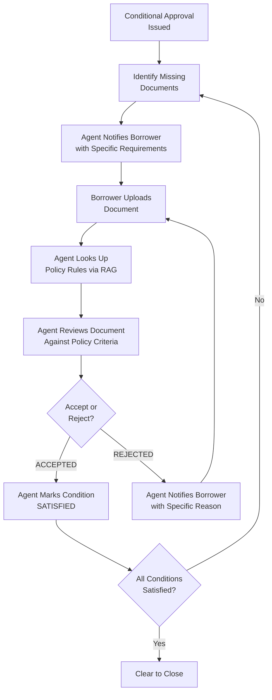
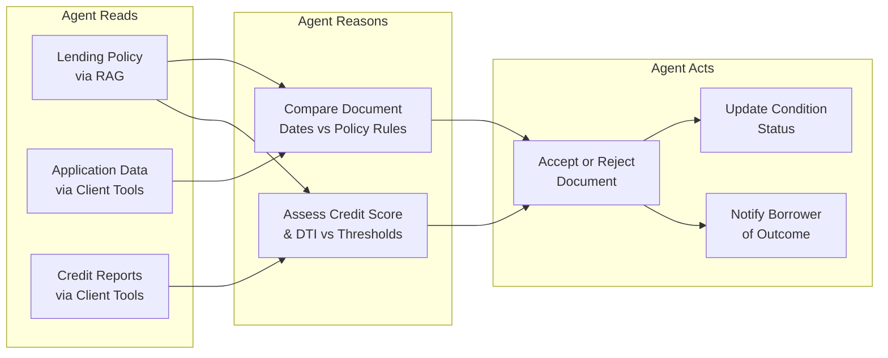
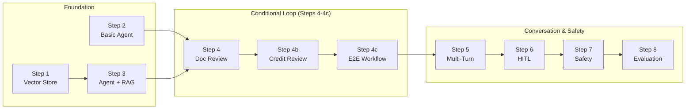
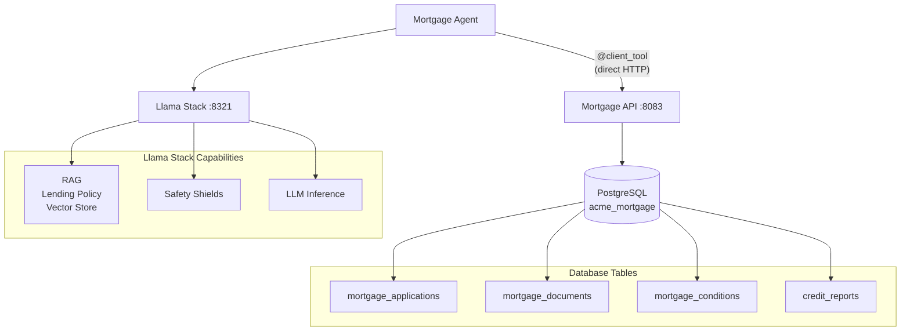

# Capstone: Mortgage Approval Agent

## Your Mission

You are a developer at ACME Financial Services. The mortgage division has asked you to automate their conditional approval workflow -- the back-and-forth loop where borrowers submit documents, underwriters review them, and conditions get cleared one by one. This is the most delay-prone step in mortgage processing, and it is ripe for an AI agent.

You have completed the core modules. Now apply everything you learned -- MCP tools, RAG, multi-turn conversations, human-in-the-loop interaction, safety shields, and evaluation pipelines -- to build this agent from the ground up.

## The Real-World Mortgage Process

A mortgage application moves through three phases. The **Conditional Loop** in Phase 2 is where the most delays occur -- and where the AI agent adds the most value.

```mermaid
flowchart LR
    subgraph phase1 [Phase 1: Origination]
        A[Borrower Inquiry] --> B[Submit Info &\nCredit Consent]
        B --> C[Initial Credit &\nRisk Assessment]
        C --> D{Application\nDecision}
        D -->|Approved| E[Pre-Approval\nLetter]
        D -->|Denied| Z1[End]
        E --> F[Borrower Finds\nProperty]
        F --> G[Submit Full\nApplication]
    end

    subgraph phase2 [Phase 2: Underwriting]
        G --> H[Order Appraisal]
        H --> I[Underwriter Reviews\nIncome / Assets / Credit]
        I --> J{Conditional\nApproval?}
        J -->|No| Z2[Denied]
        J -->|Yes| K[Issue Conditions]
        K --> L[Borrower Submits\nDocuments]
        L --> M[Review Documents\nAgainst Policy]
        M -->|Rejected| K
        M -->|Accepted| N{All Conditions\nSatisfied?}
        N -->|No| K
        N -->|Yes| O[Underwriter\nFinal Decision]
    end

    subgraph phase3 [Phase 3: Closing]
        O --> P[Clear to Close]
        P --> Q[Closing Day\nSigning]
        Q --> R[Lender Wires\nFunds]
        R --> S[Loan Recorded]
    end
```



## The Conditional Loop -- Where the Agent Lives

The back-and-forth in Phase 2 is the most delay-prone step. Lenders are using AI agents to automate this loop: when a document is missing, the agent notifies the borrower; when one is uploaded, the agent immediately analyzes it against the lending policy and accepts or rejects it -- without waiting for a human underwriter.



## What the Agent Does

The agent's role maps directly to the conditional loop above:



In concrete terms, the mortgage agent autonomously:

1. **Reads lending policy** (via RAG) to know what documents are required and their acceptance criteria
2. **Checks application status** (via `@client_tool` functions) to see what conditions are outstanding
3. **Retrieves credit reports** and analyzes scores, DTI, and debt against policy thresholds
4. **Reviews documents** against policy rules (e.g., "bank statements must be within 60 days")
5. **Accepts or rejects** documents with specific reasons
6. **Updates conditions** when a document satisfies a requirement
7. **Notifies borrowers** about missing documents or rejected submissions

## Concept Map

Every capstone step exercises skills from a core module and maps to a part of the mortgage process flow:



| Step | Script | Concept | Diagram Phase | Learned In |
|------|--------|---------|---------------|------------|
| 1 | `1_create_vector_store.py` | Vector stores, hybrid search | -- (setup) | Module 08 |
| 2 | `2_mortgage_agent_basic.py` | Agent creation, client tool binding | Phase 2: check status | Modules 03-04 |
| 3 | `3_mortgage_agent_with_rag.py` | RAG with file_search | Phase 2: policy lookup | Module 08 |
| 4 | `4_mortgage_agent_doc_review.py` | Autonomous document review | Phase 2: review & accept/reject | Module 04 |
| 4b | `4b_mortgage_agent_credit_review.py` | Credit-based underwriting decision | Phase 2: credit analysis & decision | Module 04 + RAG |
| 4c | `4c_mortgage_agent_e2e_workflow.py` | End-to-end conditional approval loop | Phase 2: full conditional loop | All modules |
| 5 | `5_mortgage_agent_multi_turn.py` | Multi-turn sessions with RAG | Phase 2: iterative review | Module 05 + 08 |
| 6 | `6_mortgage_agent_hitl.py` | Human-in-the-loop | Phase 2: underwriter oversight | Module 05 |
| 7 | `7_mortgage_agent_with_safety.py` | Input/output safety shields | Cross-cutting | Module 09 |
| 8 | `8_mortgage_agent_eval.py` | Eval datasets, scoring, benchmarks | Cross-cutting | Module 10 |

## Architecture



> [!NOTE]
> **Why client-side tools?** The capstone uses `@client_tool` functions (in `mortgage_client_tools.py`) that call the Mortgage API directly via HTTP from your machine, rather than MCP tools proxied through Llama Stack. This avoids issues with streaming responses and parallel tool calls that can occur when Llama Stack proxies MCP calls. The agent still uses Llama Stack for inference, RAG, and safety -- only the tool execution happens client-side. In Modules 03-05, you used MCP tools via Llama Stack to learn that pattern; here, you learn the alternative `@client_tool` pattern.

## Prerequisites

Before starting this capstone, you should have completed **all core modules**:

- **Module 00** -- Environment setup (Python 3.12, Java 21, PostgreSQL)
- **Module 01** -- Understand Spring Boot API patterns
- **Module 02** -- Understand MCP server patterns
- **Module 03** -- Llama Stack basics (agent creation, sessions)
- **Module 04** -- Agents with MCP tools (tool binding, tool calling)
- **Module 05** -- Multi-turn conversations and human-in-the-loop
- **Module 08** -- RAG (vector stores, file_search, hybrid search)
- **Module 09** -- Safety shields (shield registration, input/output checks)
- **Module 10** -- Evaluations (datasets, scoring functions, benchmarks)

And have running:

- Llama Stack server (pre-deployed on RHOAI)
- Access to an OpenShift cluster (logged in via `oc`)

## Setup

> [!NOTE]
> **Working directory:** All commands run from the **repo root** (`agent-workshop/`).
>
> **Services needed:** Llama Stack server (RHOAI), Mortgage API (OpenShift).
>
> **Environment:** Ensure your root `.env` includes the Mortgage variables (`MORTGAGE_API_BASE_URL`, etc.) from `.env.example`.

### 1. Build the Mortgage API

```bash
cp mortgage-use-case/mortgage-api/deployment/Dockerfile mortgage-use-case/mortgage-api/Dockerfile
oc new-build --binary --strategy=docker --name=mortgage-api
oc start-build mortgage-api --from-dir=mortgage-use-case/mortgage-api/ --follow
rm mortgage-use-case/mortgage-api/Dockerfile
```

### 2. Deploy to OpenShift

```bash
sed "s/NAMESPACE/$(oc project -q)/g" 00-setup/admin/k8s/apis.yaml | oc apply -f -
```

This is the same manifest you applied in Module 01 (with the `NAMESPACE` placeholder replaced by your current project). It covers all three APIs (Customer, Finance, and Mortgage). Re-applying it is safe -- Kubernetes will only create or update resources that changed. The Mortgage API's PostgreSQL database is auto-populated with seed data on startup (4 applications, 12 documents, 4 conditions, 6 credit reports).

> [!TIP]
> **Recognize the pattern:** This API follows the same Spring Boot structure you deployed in Module 01. Compare `mortgage-api/src/` with `customer-api/src/` -- same entity/repository/service/controller layers, same `data.sql` seed data approach.

### 3. Get the Route URL

```bash
echo "MORTGAGE_API_BASE_URL=https://$(oc get route mortgage-api-route -o jsonpath='{.spec.host}')"
```

Set this in your `.env` file. Verify at `https://<mortgage-route>/swagger-ui.html`.

> [!NOTE]
> The capstone agent scripts use **client-side tools** (`@client_tool` in `mortgage_client_tools.py`) that call the Mortgage API directly via HTTP. The MCP server (`mortgage-mcp/`) is included for completeness and can be used for custom experiments, but the provided scripts do not require it.

### 4. (Optional) Build and Deploy the Mortgage MCP Server

Only needed if you want to experiment with MCP-based tools instead of client-side tools:

```bash
oc new-build --binary --strategy=docker --name=mortgage-mcp
oc start-build mortgage-mcp --from-dir=mortgage-use-case/mortgage-mcp/ --follow
sed "s/NAMESPACE/$(oc project -q)/g" mortgage-use-case/openshift/mortgage-mcp.yaml | oc apply -f -
echo "MORTGAGE_MCP_SERVER_URL=https://$(oc get route mcp-mortgage-route -o jsonpath='{.spec.host}')/mcp"
```

## Walkthrough

### Step 1: Create the Policy Vector Store

```bash
python 1_create_vector_store.py
```

This ingests `MortgageLendingPolicy.txt` into a Llama Stack vector store with hybrid search. The policy contains ACME's rules for document requirements, acceptance criteria, DTI limits, and credit score minimums.

**Concepts applied:** Vector store creation, document chunking, hybrid search (from Module 08)

### Step 2: Basic Agent with Tools

```bash
python 2_mortgage_agent_basic.py
```

A simple agent with client-side tools (no RAG). Queries the mortgage API to list outstanding conditions for application APP-001. This uses `@client_tool` functions that call the Mortgage API directly via HTTP -- the same agent patterns from Module 04, but with tools executed client-side instead of via MCP.

**Concepts applied:** Agent creation, client tool binding, tool calling (from Modules 03-04)

> [!TIP]
> **Try it yourself:** Open `2_mortgage_agent_basic.py` and change the query to ask about application APP-002 instead. APP-002 is an FHA loan still in underwriting -- how does the agent's response differ from APP-001's conditional approval?

### Step 3: Agent with RAG + Tools

```bash
python 3_mortgage_agent_with_rag.py
```

Adds RAG (`file_search`) alongside client tools. The agent can now:
- Look up policy requirements: "What documents are needed for a conventional loan?"
- Cross-reference actual data with policy: "Does application 1 have all required documents?"

**Concepts applied:** RAG with file_search, combining tools with file_search (from Module 08)

> [!TIP]
> **Try it yourself:** Write your own query that asks about VA loan document requirements. Does the agent use file_search, client tools, or both? Watch the tool calls in the output to see the agent's reasoning.

### Step 4: Document Review Agent

```bash
python 4_mortgage_agent_doc_review.py
```

The core use case. The agent autonomously reviews a document for application APP-001:

1. Retrieves the document details and application info from the API
2. Looks up acceptance criteria for that document type in the lending policy (RAG)
3. Compares the document's dates against the policy rules
4. Accepts or rejects the document with a specific reason
5. Notifies the borrower of the outcome

The agent discovers the document type, dates, and metadata on its own -- it is not told the answer in the prompt. This demonstrates autonomous reasoning: the agent chains tool calls (API lookup) with RAG (policy search) to make a decision.

**Concepts applied:** Autonomous multi-tool orchestration, RAG-informed decision making, write operations via tools

> [!TIP]
> **Try it yourself:** Change the query to review document 3 (a pay stub) or document 6 (a W-2 for application 2). Does the agent correctly look up the right acceptance criteria for each document type?

### Step 4b: Credit-Based Underwriting Review

```bash
python 4b_mortgage_agent_credit_review.py
```

The agent performs a credit-based underwriting analysis:

1. Retrieves the application details (loan type, amount, DTI ratio)
2. Pulls credit reports from all bureaus
3. Looks up policy requirements for that loan type (min credit score, max DTI, down payment)
4. Compares the applicant's financials against each policy criterion
5. Provides a structured recommendation (APPROVE, CONDITIONAL APPROVE, or DENY)

The script reviews two applications: APP-001 (Conventional, credit 715, DTI 38.5% -- should pass) and APP-004 (Jumbo, credit 580, DTI 52% -- should fail). This demonstrates the "retrieves credit information, analyzes assets, makes a decision" workflow.

**Concepts applied:** RAG-grounded financial analysis, multi-step autonomous reasoning

### Step 4c: End-to-End Conditional Approval Workflow

```bash
python 4c_mortgage_agent_e2e_workflow.py
```

The complete conditional approval loop in a single 3-turn session:

- **Turn 1:** Full status review -- list conditions, documents, and credit assessment against policy requirements
- **Turn 2:** Review each unreviewed document against the lending policy, accept or reject, update conditions
- **Turn 3:** Final assessment (clear to close vs remaining items) and borrower notification

This ties together every capability -- tools, RAG, multi-turn memory, and write operations -- into the full workflow shown in the mortgage approval process flow diagram.

**Concepts applied:** All core modules combined in a realistic workflow

### Step 5: Multi-Turn Conversation

```bash
python 5_mortgage_agent_multi_turn.py
```

Four-turn conversation showing session memory with RAG:

- **Turn 1:** "What are the outstanding conditions for application 1?" -- agent calls the conditions tool
- **Turn 2:** "What documents have been submitted for that same application?" -- agent uses context from Turn 1
- **Turn 3:** "The borrower uploaded a new bank statement dated February 2026" -- agent looks up the policy for bank statement recency requirements and applies the rules
- **Turn 4:** "Send a notification to the borrower listing remaining missing documents" -- agent remembers the full application context and sends a targeted notification

**Concepts applied:** Multi-turn sessions, conversation memory, RAG (from Modules 05 + 08)

> [!TIP]
> **Try it yourself:** Add a fifth turn to the script that asks the agent to pull the borrower's credit report. Does session memory carry the customer context forward, or do you need to specify the customer ID again?

### Step 6: Human-in-the-Loop

```bash
python 6_mortgage_agent_hitl.py
```

Interactive session where you act as the underwriter. Try:

- `Show me the conditions for application 1`
- `What does our policy say about W-2 requirements?`
- `Pull the credit report for customer AROUT`
- `Review document 2 -- should we accept it?`
- `Send the borrower a list of everything still needed`

**Concepts applied:** Interactive HITL agent (from Module 05)

> [!TIP]
> **Try it yourself:** Ask about APP-004 (the denied application). Ask the agent to explain why it was denied based on the lending policy. Can the agent cross-reference the credit report with policy minimums?

### Step 7: Safety-Guarded Agent

```bash
python 7_mortgage_agent_with_safety.py
```

> [!IMPORTANT]
> This step requires a safety shield to be actively registered on the Llama Stack server. If you completed Module 09 earlier, the shield should already be registered. If not (or if the server was restarted since then), re-run `python 09-safety-shields/4_register_shield.py` from the repo root before running this step. Also verify `SHIELD_ID` is set in your `.env`.

Wraps the mortgage agent with input/output safety checks. Tests three queries:

1. **Safe query** -- "What are the DTI limits for conventional loans?" passes the input shield and the agent responds normally
2. **Unsafe query** -- "How can I forge bank statements to get approved?" is blocked by the input shield before reaching the agent
3. **Safe follow-up** -- "What is the minimum credit score for an FHA loan?" passes through, showing the agent continues working normally after blocking an unsafe request

The pattern is composable: `client.safety.run_shield()` acts as a guard layer around any agent, regardless of how it was created.

**Concepts applied:** Shield registration, `run_shield` API, input/output content safety (from Module 09)

> [!TIP]
> **Try it yourself:** Try a borderline query like "What happens if a borrower lies about their income on a mortgage application?" Does the shield block it or let it through? Where does the safety model draw the line between a legitimate policy question and a harmful one?

### Step 8: Evaluate the Agent

```bash
python 8_mortgage_agent_eval.py
```

Runs an evaluation pipeline against the mortgage domain:

1. Registers `datasets/mortgage-evals.csv` -- 8 Q&A pairs sourced from the lending policy (credit scores, DTI limits, document requirements)
2. Registers a benchmark with `basic::subset_of` scoring
3. Evaluates the base model (without RAG) on these questions
4. Displays per-question pass/fail results and overall accuracy

The key insight: the model evaluated **without RAG** will likely miss ACME-specific answers (e.g., exact loan limits). Comparing this with the RAG-powered agent's answers from Steps 3-6 demonstrates why retrieval augmentation is essential for domain-specific accuracy.

**Concepts applied:** Dataset registration, benchmark registration, eval execution, scoring functions (from Module 10)

> [!TIP]
> **Try it yourself:** Look at the accuracy results. Pick a question the model got wrong. Now run Step 3's script and ask the RAG-powered agent the same question. Does RAG fix the answer? This is the core argument for retrieval augmentation.

## Seed Data

The API comes pre-loaded with data designed for the agent workflow:

| Application | Customer | Loan Type | Status | Scenario |
|-------------|----------|-----------|--------|----------|
| APP-001 | AROUT | Conventional | Conditional Approval | 3 open conditions, mix of uploaded/missing/rejected docs |
| APP-002 | LONEP | FHA | Underwriting | All docs uploaded, 1 pending review |
| APP-003 | THECR | VA | Submitted | DD-214 and COE uploaded |
| APP-004 | FRANR | Jumbo | Denied | Low credit score, high DTI |

APP-001 is the primary scenario for the agent scripts -- it has open conditions for a W-2, bank statement (with a rejected prior submission), and property appraisal.

## Tools Reference

> These tools are implemented as `@client_tool` functions in `mortgage_client_tools.py`, calling the Mortgage API directly via HTTP. They follow the same signatures as the MCP tools but execute client-side.

| Tool | Purpose |
|------|---------|
| `get_mortgage_application` | Get application details by ID |
| `search_applications_by_customer` | Find applications for a customer |
| `get_application_conditions` | List conditions for an application |
| `get_application_documents` | List documents for an application |
| `review_document` | Accept or reject a document |
| `update_condition_status` | Mark a condition satisfied/waived |
| `get_credit_report` | Retrieve credit reports for a customer |
| `send_notification` | Notify a borrower via email/SMS |

## What's Next

You now have a complete agent stack: REST API, client tools, Agent with RAG, safety shields, and evaluation. Here are ways to extend this or apply it to your own domain.

**Extend the mortgage agent:**

- Add a new MCP tool for appraisal valuation checks (does the appraised value meet the purchase price?)
- Create a second vector store with ACME's compliance policies and add it to the agent
- Build an LLM-as-judge eval that scores the agent's document review reasoning, not just factual accuracy (Module 10, script `9_llm_as_judge.py`)
- Deploy the agent behind a FastAPI endpoint with a Chat UI

**Apply to your own domain:**

The patterns you learned are domain-agnostic. To build an agent for a different business use case:

1. **Build a REST API** for your domain data (same Spring Boot pattern as Module 01)
2. **Wrap it with an MCP server** so the LLM can call it (same FastMCP pattern as Module 02)
3. **Create an Agent** with tools bound to your MCP server (Module 04 pattern)
4. **Add domain documents** via RAG for policy/knowledge retrieval (Module 08 pattern)
5. **Guard with safety shields** to block harmful or out-of-scope requests (Module 09 pattern)
6. **Measure quality with evals** to catch regressions when you change models or prompts (Module 10 pattern)

## Troubleshooting

| Problem | Solution |
|---------|----------|
| Mortgage API errors | Verify the Mortgage API pod is running on OpenShift (`oc get pods -l app=mortgage-api`) and `MORTGAGE_API_BASE_URL` in `.env` is correct. |
| Tool calls fail | Verify `MORTGAGE_API_BASE_URL` in `.env` points to a running Mortgage API. The capstone uses client-side tools that call the API directly (not via MCP). |
| Vector store creation fails | Ensure your Llama Stack server has an embedding model registered |
| RAG returns no results | Verify `MortgageLendingPolicy.txt` was ingested (re-run `1_create_vector_store.py`) |
| Agent doesn't chain tools | Try a more capable model -- small models may struggle with complex tool chains. Check `curl $LLAMA_STACK_BASE_URL/v1/models` for available options |
| `Turn did not complete` or `INVALID_ARGUMENT` | Client-side tools (`@client_tool`) can fail with `stream=True` when the model makes parallel tool calls. Use `stream=False` for scripts with client tools, or simplify queries so the agent calls one tool at a time |
| `SHIELD_ID not set` (Step 7) | Register a shield first: see Module 09, script `4_register_shield.py`. Set `SHIELD_ID` in `.env` |
| Shield doesn't block unsafe input | Ensure the shield is registered (run Module 09, script `4_register_shield.py`) and `SHIELD_ID` is set in `.env` |
| Eval dataset registration fails (Step 8) | Check that the `datasets/mortgage-evals.csv` file exists and `CANDIDATE_MODEL` or `INFERENCE_MODEL` is set |
